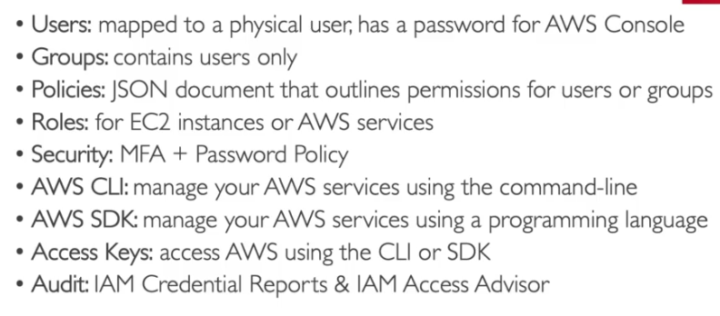

# Identity Access Manager - It is Global service
## Comprises of
1. Users
   1. always have least privilages for any user
2. Groups
3. Permissions == AWS Policy

---
## 
AWS Policy

### Aws Policy Structure (JSON Structure)
1. version -- policy language version (2012-10-17)
2. id
3. statement -- can be multiple
   1. sid -- statement id
   2. Effect -- whether to allow or deny access to resource
   3. Principal -- account/user/role to which the policy is applicable to
   4. Action -- list of api calls that are acted based on effect
   5. Resource -- list of resources that can be used by the user based on Effect
   6. Condition -- based on condition the Effect may change
---
## 
AWS Access Management

1. Aws Management Console -- protected by password + MFA
2. AWS CLI -- protected by access keys
3. AWS SDK -- protected by access keys
### Access Keys
1. generated from AWS Management console
2. User shouldnt share them
3. accesskeyID == username, secretAccessKey == Password
### AWS CLI Installation

---

## 
IAM Roles.

1. sometimes the aws services needs some permission from user to complete their execution,just like users needing permission to do a thing
2. we are giving such permission directly to aws services via `IAM Roles`
3. Used only for aws services, but not for physical people

---

## 
IAM security Tools

### **Credentials Report (Account Level)**
1. A report that lists all account's user and their status of their various cred
### **IAM Access Advisor (User Level)**
1. shows all permissions granted for that user and when were they `last accessed`
2. you can use this info to revise that user permission to have least privilages

---

# 
 IAM Best Practices

1. `dont use root account credentials except for aws account creation`
2. 1 aws user= 1 physical user
3. assing user to group and assign permission to group
4. `create strong password policy`
5. `Use MFA`
6. create and use `IAM Roles` for giving/assigning permission to aws services
7. `use access keys for programmatic access --> CLI / SDK`
8. Audit permissions of all users via IAM credentials Manager
9. ## `Never share IAM users & access keys`

---

## Summary

