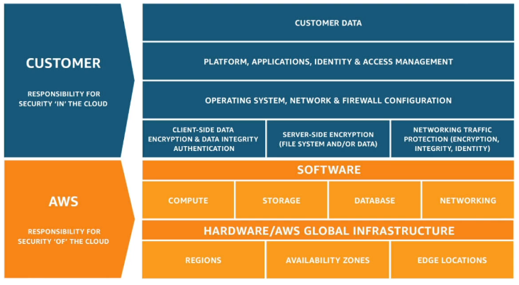

# Introduction
AWS Cloud Practitioner (CLF-C01) Exam
https://courses.datacumulus.com/downloads/certified-cloud-practitioner-zb2/ to download the code and slides.

## Cloud Computing
* This is the on demand delivary of all components needed to run a web application
* pay as go pricing for above 
* we can have right size and type of computing, and accessed at very instant
* resource pooling on any resource on above
* rapid elasticity and scalability
* go Global in minutes
* Models of cloud
  * Private
  * Public
  * Hybrid
* # Types of Cloud Computing
  * # IAAS:
    1. providing networking, computers and datastorages
    2. highest level of flexibility
    3. building block of IT 
  * # PAAS:
    1. removes need of organization to maintain all of the infrastructure
    2. focueses on deployment and management of your app
  * # SAAS:
    1. complete product run, maintained and taken care by service provide
    2. you use only services provided
* Advantages
  * Trade captial expanse (CAP-EX) for Operational Expense (OP-EX)
  * Go Global in minutes
  * stop spending money on maintaining and running data centers

---
## 
Shared Responsibility Model

### You're gonna get multiple questions on this topic in exam
### This is majorly used to describe the roles
1. AWS is responsible for (Obviously giving necessary infrastructure)
   1. Infrastrcture development and maintainance
   2. Security analysis and maintainance
   3. configuration management
   4. Compliance Validation
   5. Isolation of physical hosts
2. You are responsible for (Obviously how proerly you use given infrastructure)
   1. User and Group and Policies management and monitorning
   2. MFA enforcing on all accounts
   3. Security Groups
   4. OS Updates and Patches, Software installation and update and their mainataince
   5. Use IAM tools to apply appropriate permissions to anyone
   6. Analyze access patterns and review permission to others users

---

## Glossary

1. files
2. IAM
3. EC2
   1. EC2 Internal Storage
   2. AMI
4. Load Balancing
   1. ELB (Load Balancing)
   2. ASG (Load Balancing)
   3. Auto scaling
5. S3
6. Databases
   1. RDS
   2. Elastic Cache
   3. Dynamo DB
   4. Redshift
   5. EMR
   6. QuickSight
   7. Document DB
   8. QLDB
   9. Managed BlockChain
   10. Glue
   11. DMS
   12. Analytics
7. Compute Engines like EC2
   1. Docker
   2. ECS
   3. Fargate
   4. ECR
   5. Severless
      1. Intro
      2. Lambd functions
   6. API Gateway
   7. Batch
   8. LightSail
8. Deployments & Managing Infrastructure
   1. Cloud Formatiom
   2. CDK
   3. BeanStalk
   4. CodeDeploy
   5. CodeCommit
   6. CodeBuild
   7. CodePipeline
   8. CodeArchitifact
   9. CodeStar
   10. Cloud9
   11. Systems Manager(SSM)
   12. Ops
9.  Routes/Global/Live Application
    1. ROute S3
    2. CloudFront
    3. Transfer Accelaration
    4. AWS Outpost
    5. AWS WaveLengths
    6. AWS LocalZones
    7. Global Applications Architecture
10. Cloud Integrations
    1. SQS
    2. Kinesis
    3. SNS
    4. Amazon MQ
11. Cloud Monitoring
    1. CloudWatch Metrics
    2. CloudWatch Alarms
    3. EventBridge
    4. CloudTrail
    5. X-Ray
    6. CodeGuru
    7. Service Health dashboard
12. VPC & Networking
    1. VPC
    2. Subnet, Internet Gateway, NAT Gateway
    3. Security Groups, Network Access Control List
    4. VPC Flow Logs
    5. VPC Peering
    6. VPC Endpoints
    7. Private Link
    8. Direct COnnect
    9. Site to Site connect
    10. client vpn
    11. transit gateway overview
13. Security
    1. DDOS protection
    2. Pentesting
    3. Encryption with KMS & CloudHSM
    4. Aws Certificate Manager
    5. Secret Manager
    6. Artifact
    7. GuardDuty
    8. Inspector
    9. Config
    10. Macie
    11. Security Hub
    12. Amazon Detective
    13. AWS Abuse
14. Machine Learning
    1. Rekognition
    2. Transribe
    3. Polly
    4. Translate
    5. Lex+ Connector
    6. Comprehend
    7. SegaMaker
    8. Forecast
    9. Kendra
    10. personalize
    11. Textract
15. Account & Billing Management
    1.  Organisation
    2.  AWS Control Tower
    3.  Pricing Models
    4.  BIlling & cost tools
    5.  Estimating Cost
    6.  Tracking Costs
    7.  Monitoring Costs
    8.  AWS Trusted Advisors
    9.  Support Plans for AWS
    10. Accounts Best Practices
16. Advanced Identity
    1.  STS
    2.  Cognito
    3.  Directory Service
    4.  AWS IAM Identity Center
17. Workspace
18. AppStream 2.0
19. Sumerian
20. Iot Core
21. Elastic Transcode
22. AppSync
23. Amplify
24. AppSync
25. AWS Backups
26. Disastor Recovery Strategies -- AWS Elatic Disaster Recovery
27. AWS DataSync
28. Application Direcoty & Migration service
29. AWS Fault INjection SImulator
30. Step function
31. Ground Function
32. AWS Pinpoint
33. AWS Architecture & Eco System
    1.  whitepapers
    2.  operation excellence
    3.  security
    4.  performance efficient
    5.  cost optimization
    6.  sustainability
    7.  aws well-architecture tools
    8.  aws ecosystem
    9.  aws knowledge center
    10. aws IQ & re:post
34. Questions asked during the courses/quizes
